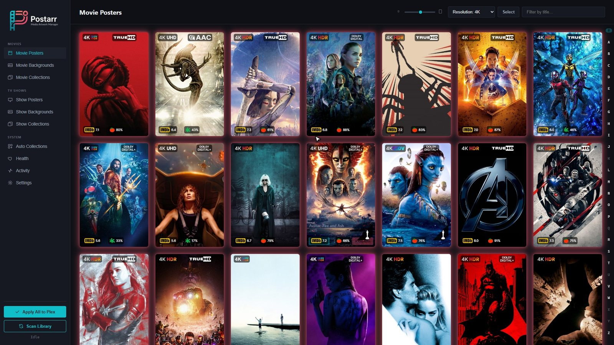
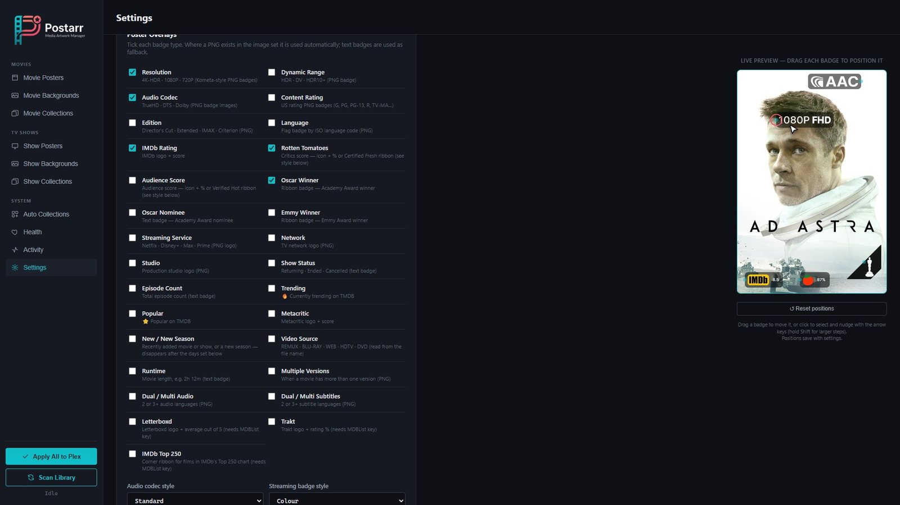
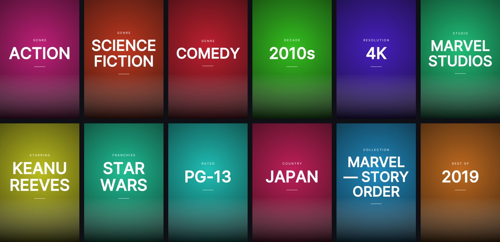
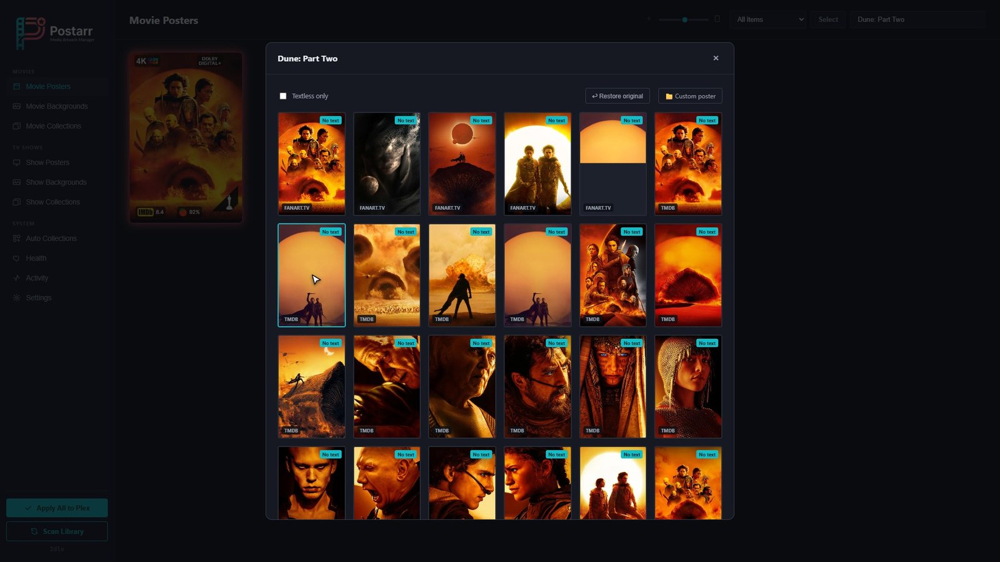
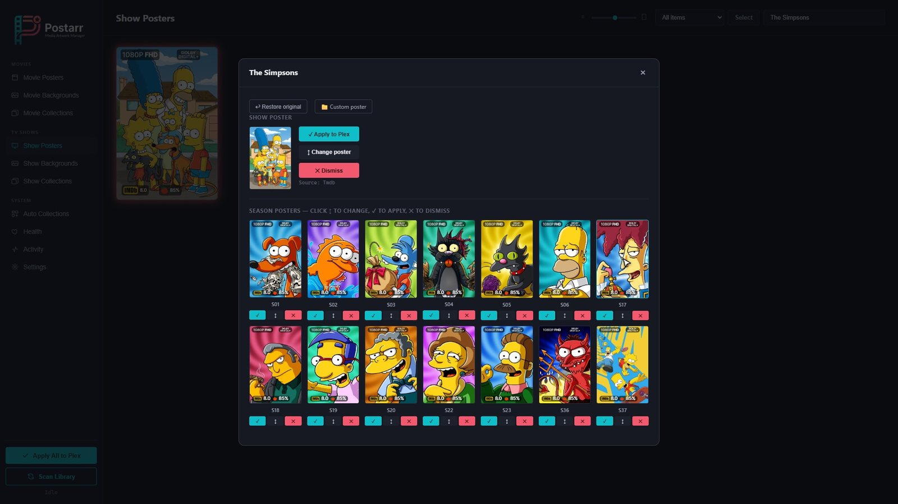
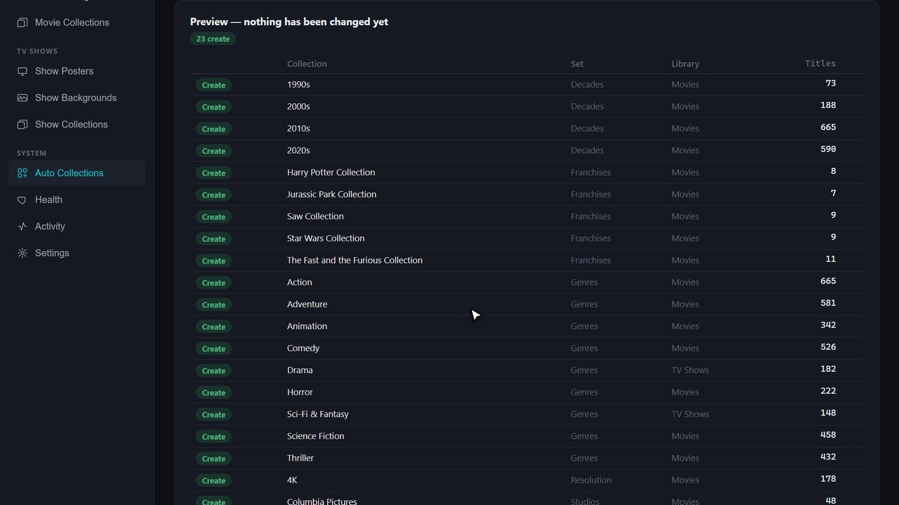
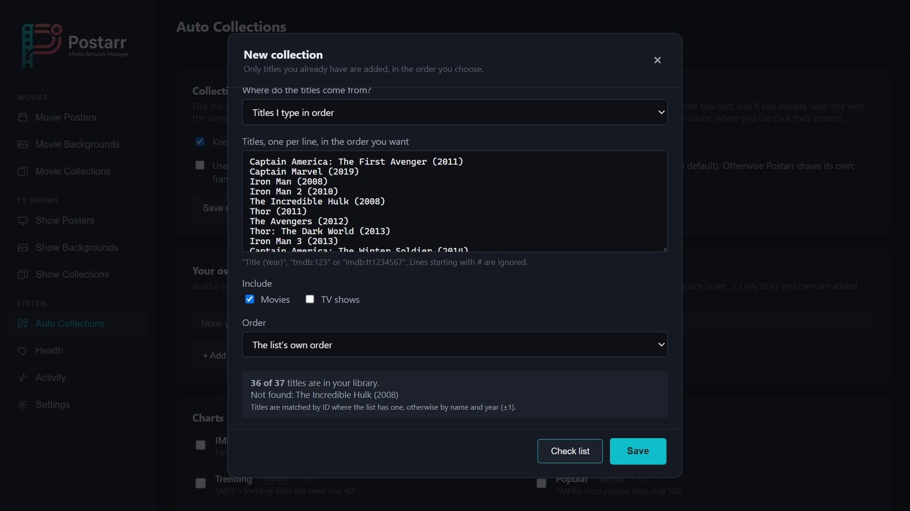
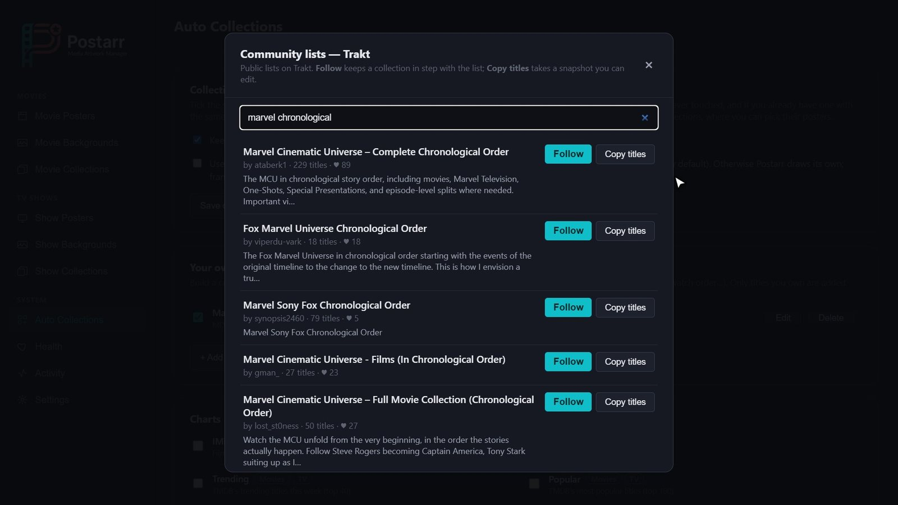
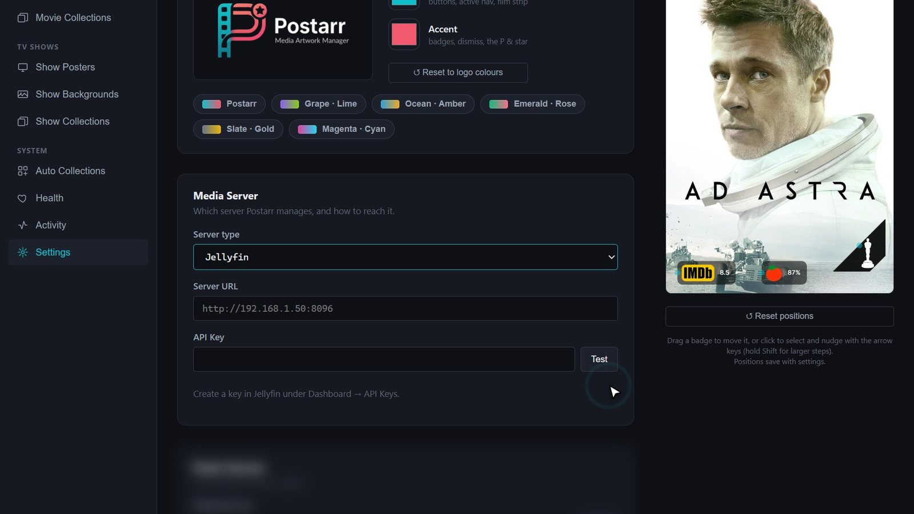

<p align="center">
  
</p>

<p align="center">
  <b>Posters, backgrounds and collections for Plex, Jellyfin and Emby — with Kometa-style badges and no config files.</b>
</p>

<p align="center">
  
</p>

Postarr is a self-hosted artwork manager in the style of Sonarr and Radarr. It scans your media server, finds the best
posters and backgrounds from **TMDB**, **FanArt.tv** and **TheTVDB**, draws quality and rating badges onto them, and
applies them for you — automatically, or after you've approved them. It also builds collections the way Kometa does,
but everything is done from a web page instead of YAML.

It runs on **Windows** (installer with a background service and tray icon) and on **Linux / NAS / Raspberry Pi** (Docker,
amd64 and arm64).

https://github.com/user-attachments/assets/53fcd6f8-b81a-4513-939a-ba5213efef77

## Features

**Posters and backgrounds**
- Pick from TMDB, FanArt.tv and TheTVDB side by side, with "textless only" filtering and your media server's own artwork.
- Season posters, with FanArt.tv **sets** marked in the picker and a "match the other seasons" option that applies a whole
  matching set in one go — or let the scan prefer matching sets automatically.
- Backgrounds and collection posters, plus your own uploads.
- Everything Postarr replaces is backed up first, so you can restore the original.

**Badges**
- Resolution, HDR / Dolby Vision, audio codec, edition, content rating, studio, network, streaming service, IMDb / Rotten
  Tomatoes / Metacritic / Letterboxd / Trakt ratings, IMDb Top 250, Oscar and Emmy winners, NEW / NEW SEASON, runtime,
  multiple versions, dual audio and subtitles, and more — each optional.
- A live preview where you drag each badge to where you want it.

<p align="center"></p>

**Collections**
- **Auto collections**: genres, decades, years, franchises, studios, networks, streaming services, actors, directors,
  countries, languages, resolution, content rating, charts (IMDb Top 250, Letterboxd, TMDB trending / popular / top
  rated), award winners and "Best of the year" — tick the ones you want, preview, apply.
- **Your own lists**: type titles in the order you want (Marvel in story order…), or follow a **community list** from
  **MDBList** or **Trakt** — search them right inside Postarr — or a TMDB list. Postarr keeps the list's order on Plex and
  Jellyfin.
- Postarr draws a poster for each collection it makes (or uses Kometa's default images, if you opt in), and only ever
  changes collections it created itself.

<p align="center"></p>

**Everyday use**
- Plex, Jellyfin and Emby. New content is picked up instantly (Plex webhook, or a live connection to Jellyfin / Emby).
- Apply All with progress, scheduled scans, a health page, an activity log, colour themes, and a phone-friendly layout.
- A login protects it (it holds your media server token and API keys).

## Screenshots

| | |
|---|---|
|  |  |
|  |  |
|  |  |

## Install

### Windows

1. Download `Postarr-Setup-<version>.exe` from the [Releases](../../releases) page and run it.
2. It installs Postarr as a background service that starts with Windows, adds a tray icon, and opens the firewall for
   your private network.
3. Open **http://localhost:5286** (or `http://<this-pc>:5286` from another device).

> Until the installer is code-signed, Windows may say it "protected your PC". Choose **More info → Run anyway**.

> Can't reach it from another device? The installer lets in devices on your local network only. If yours is on a
> different subnet (another VLAN, or a VPN), add a Windows Firewall rule for TCP port 5286 yourself.

### Docker (Linux, NAS, Raspberry Pi)

```bash
docker run -d --name postarr \
  -p 5286:5286 \
  -v /path/to/postarr/config:/config \
  -e PUID=1000 -e PGID=1000 \
  --restart unless-stopped \
  ghcr.io/archang3lsfury/postarr:latest
```

Images are published for amd64 and arm64. Compose file, permissions, ports and moving an existing Windows install into a
container are covered in [DOCKER.md](DOCKER.md).

## Getting started

1. **Create your login.** The first time you open Postarr it asks you to create one — it stays locked until you do.
2. **Settings → Media Server**: choose Plex, Jellyfin or Emby, enter its address and token / API key, and click **Test**.
3. **Settings → Poster Sources**: add the API keys you have and test each. All are free:
   - TMDB — https://www.themoviedb.org/settings/api (posters, metadata, collections — strongly recommended)
   - FanArt.tv — https://fanart.tv/get-an-api-key/ (more posters, season sets)
   - TheTVDB — https://thetvdb.com/api-information
   - OMDb — https://www.omdbapi.com/apikey.aspx (IMDb, Rotten Tomatoes, Metacritic, Oscars / Emmys)
   - MDBList — https://mdblist.com/preferences (audience scores, Letterboxd / Trakt ratings, MDBList lists)
   - Trakt — https://trakt.tv/oauth/applications (create an app and use its Client ID; for Trakt lists)
4. Choose your badges, then click **Scan Library**.
5. Optional, Plex Pass: for instant updates, copy the webhook address shown under **Settings → Library Scanning → Plex webhooks** into Plex →
   Settings → Webhooks. It includes a private token, so it works while login is on.

Postarr doesn't need access to your media files — only network access to your media server and to the internet.

## Building from source

Requires the [.NET 8 SDK](https://dotnet.microsoft.com/download/dotnet/8.0).

```bash
dotnet run --project src/Postarr/Postarr.csproj
```

That starts Postarr on http://localhost:5286, with its data in the build folder. To build the Windows installer or the
Docker image yourself, see [RELEASING.md](RELEASING.md).

```
src/Postarr/        the app (ASP.NET Core): Controllers, Services, Overlays (SkiaSharp), Plex/, Jellyfin/, Metadata/, wwwroot/ (web UI)
src/PostarrTray/    Windows tray helper
deploy/             Inno Setup installer script
.github/workflows/  release builds (Windows installer, Docker images)
```

## Known limitations

- Plex has no way to delete uploaded posters through its API; Postarr avoids re-uploading unchanged artwork, but old
  uploads can only be removed in Plex itself.
- Emby can't keep a custom collection order (it sorts collections by release date or name); Plex and Jellyfin can.
- ThePosterDB has no public API, so it isn't a poster source.

## Code signing

Windows releases are built from this repository by GitHub Actions, but the installer is **not code-signed yet**, so
Windows SmartScreen shows a warning (choose **More info → Run anyway**). Code signing is planned once the project is
established. You can check a download against the source: every release is built from a version tag on this
repository, and the build log is public on the Actions tab.

- Maintainer: [Mathew Kerr](https://github.com/ArChAnG3LsFuRy) (sole maintainer).
- Privacy: Postarr sends no telemetry and collects no data. It only talks to the media server you configure and to the
  artwork / metadata services you add keys for (TMDB, FanArt.tv, TheTVDB, OMDb, MDBList, Trakt), and it downloads
  Kometa's default collection posters from GitHub if you opt in.

## Support

Postarr is free. If it saves you some time, there's a **Buy me a coffee** link in Settings → Support Postarr. Thank you!

## Licence and credits

Postarr is released under the [MIT License](LICENSE).

This product uses the TMDB API but is not endorsed or certified by TMDB. Artwork and data also come from FanArt.tv,
TheTVDB, OMDb, MDBList and Trakt. Badge images are from [Kometa](https://github.com/Kometa-Team/Kometa) (MIT License),
and the Inter font is under the SIL Open Font License. Logos shown in badges are trademarks of their owners. Plex,
Jellyfin and Emby are trademarks of their respective owners; Postarr is not affiliated with them. Full details:
[THIRD-PARTY-NOTICES.md](THIRD-PARTY-NOTICES.md).
